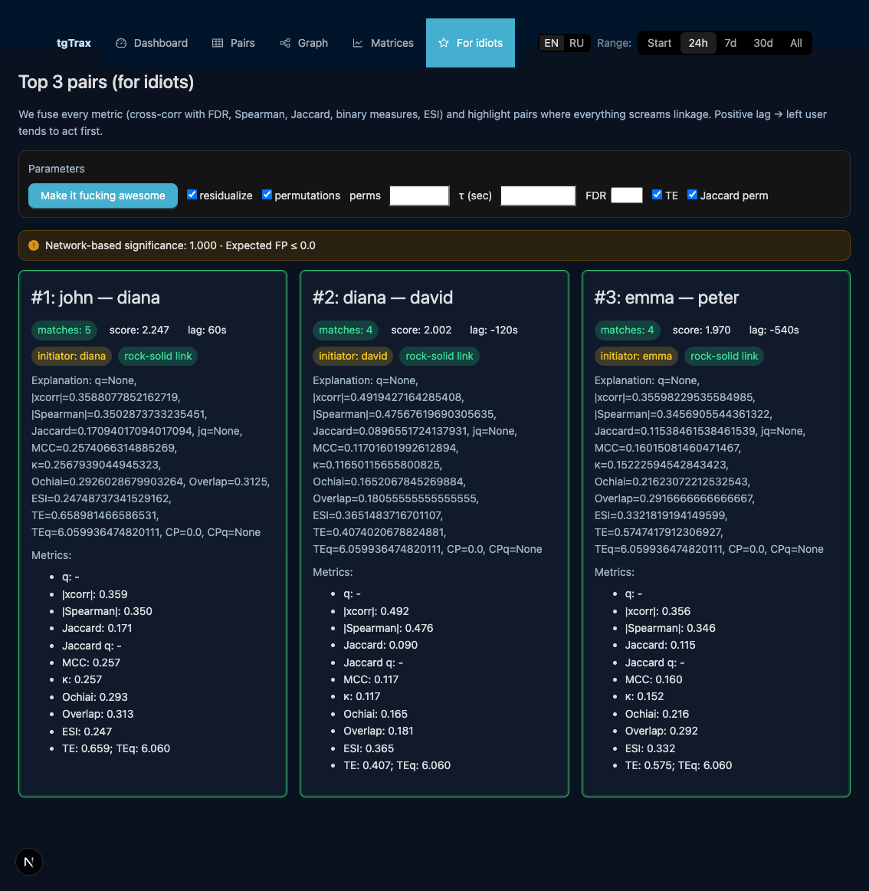

# tgTrax

**TL;DR:**
- Reveals who is connected to whom by online activity patterns in Telegram groups.
- Detects hidden groups, "leaders," and similar users automatically.
- Handles time dependencies, autocorrelation, and user timezones.




## Methods (brief rationale)

- Correlation and cross‑correlation
  - Spearman/Pearson on resampled series, optional STL and EWMA.
  - Cross‑correlation scans best lag across a finite window. We correct per‑pair for lag scanning (Bonferroni across 2K+1 lags) and control FDR across pairs with Benjamini–Yekutieli (BY) because pairwise tests are dependent.

- Transfer Entropy (TE, directed)
  - Binary k=1 estimator with balanced quantization (target share bounded, avoids degenerate series). Null via stationary bootstrap of the source only; FDR BY is applied over all directed pairs i→j (no symmetrization).

- Stability
  - Stationary block bootstrap over time (not k‑fold by order) to respect autocorrelation/drift; reports the fraction of resamples with |ρ| ≥ τ.

- Communities
  - Louvain on a combined evidence graph (correlation, cross‑correlation, Jaccard). We report modularity and p‑value vs. a degree‑preserving rewired null (double‑edge swap).

- Caching and performance
  - In‑memory caching keyed by a data fingerprint (shape, time span, sums). Permutation work uses batching and shared memory where applicable. FFT convolution only for sufficiently long series.

## Quick start

Prereqs: Python 3.10+, Node 18+ (for UI), SQLite.

1) Install

```bash
python -m venv .venv && source .venv/bin/activate
pip install -r requirements.txt
```

2) Configure

Create `.env` in repo root:

```
TELEGRAM_API_ID=...
TELEGRAM_API_HASH=...
TELEGRAM_PHONE_NUMBER=+123...
```

Optionally set `TARGET_USERS` (comma‑separated) and dashboard ports (`FLASK_HOST`, `FLASK_PORT`). A JSON config `tgTrax_config.json` is created on first run with safe defaults.

3) Run

```bash
npm run dev
```

This starts both the Flask API (http://127.0.0.1:8050) and Next.js UI (http://localhost:3000).

## API (selected)

- `GET /api/summary` — basic counts and span
- `GET /api/matrices?metric=spearman|pearson|jaccard|crosscorr_qvals` — matrices
- `GET /api/pairs/significant?method=xcorr|te|hawkes&residualize=true&fdr_method=by&top=100` — ranked pairs
- `GET /api/graph/combined?corr_threshold=0.6&jacc_threshold=0.18&q_threshold=0.05` — combined graph with communities and modularity p‑value

Notes:
- `fdr_method=by` is the default for dependent tests.
- TE uses `te_quantize=balanced` by default. `bootstrap=stationary` is recommended.
- Timezone: `/api` accepts `tz=...` to convert the index; per‑user offsets are supported internally in residualization.

## Operational notes

- Heavy calls are cached in memory (ttl configurable via env). Keys change automatically when data/params change.
- Permutations use batching; cross‑correlation permutations support multi‑process execution with shared memory.
- We keep diagonals as NaN in p/q‑matrices to avoid false positives downstream.

## Hygiene and repo layout

Tracked code only. Local data/state are ignored via `.gitignore`:
- DB files `*.db*`, sessions `*.session`/`sessions/`, logs `*.log`, pid `.tracker.api.pid`, runtime JSON.
- Node and Next artifacts: `node_modules/`, `webui/.next/`.

Do not commit `.env`, session files, or databases.

## License

MIT. See `LICENSE`.

