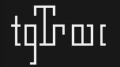
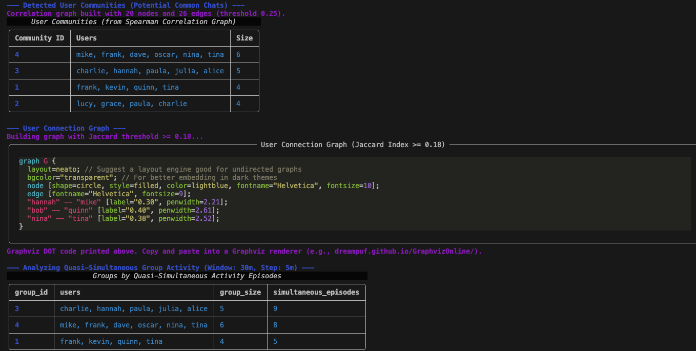

# tgTrax - Telegram Activity Analyzer

<p align="center">
  
</p>

[](https://www.python.org/)
[](https://opensource.org/licenses/MIT)

**tgTrax** is a Python-based toolkit for tracking and analyzing Telegram user activity, designed for digital forensics and behavioral analysis.

## Key Features

- **Activity Tracking:** Monitor online/offline status of Telegram users with configurable polling.
- **Temporal Analysis:** Calculate correlations (Spearman, Jaccard) and build user connection graphs.
- **Community Detection:** Identify user groups using Louvain method.
- **Gantt Charts:** Visualize activity timelines for forensic analysis.
- **SQLite Backend:** Store and query activity data efficiently.

## Quick Start

1. **Installation:**
   ```bash
   git clone <repository-url>
   cd tgTrax
   python -m venv venv
   source venv/bin/activate
   pip install -r requirements.txt
   ```

2. **Configuration:**
   - Set `TELEGRAM_API_ID` and `TELEGRAM_API_HASH` in `.env`.
   - Configure target users and thresholds in `tgTrax_config.json`.

3. **Usage:**
   - Start tracking: `./run.sh start`
   - Analyze data: `./run.sh analyze`

## Screenshots


*User communities based on activity correlation.*


*Gantt chart of user online sessions.*

## License

MIT License. See [LICENSE](LICENSE) for details.
